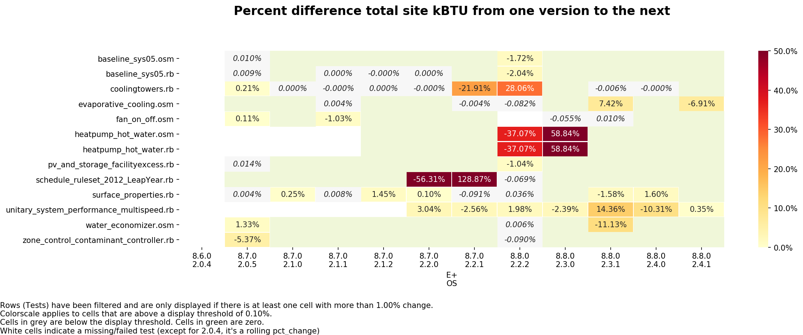
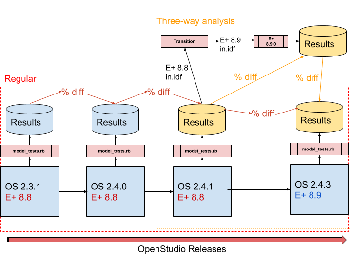

OpenStudio Resources
==========

This repository includes a suite of simulation tests that can be used to validate new OpenStudio model objects as well as ensure that objects continue to work after they are added.
Each new OpenStudio Model object should ideally have two simulation tests associated with it:

* a Ruby one which verifies the Ruby API and,
* an OSM one that verifies the OSM file can be loaded with future versions of OpenStudio.

Both tests should result in a simulation-ready OpenStudio Model that can be simulated using EnergyPlus.
Both of these tests are located in the `/model/simulationtests` directory, the easiest way to add a new test is to find a related existing test and modify it.
When new tests are added they must be added to the `model_tests.rb` file.

## Running the tests

### Model Tests (core testing)

Using the OpenStudio CLI:
```
openstudio model_tests.rb
```

To capture output in a file:

```
openstudio model_tests.rb > out.txt 2>&1
```

Using the OpenStudio Ruby bindings:

```
ruby -I \path\to\openstudio.rb\dir\ model_tests.rb
```

*Optional:* if you use your system ruby, you can do `gem install minitest-reporters` and enjoy a cleaner output.

### High Level tests

`highlevel_tests.rb` has tests that ensure all XML/OSM/RB are actually used in a test, and that all simulation/ ruby tests have a matching OSM test.

```
openstudio highlevel_tests.rb.rb
```

### SDD tests

`SDD_tests.rb` has two classes:

* `SddReverseTranslatorTests`: this loads `simulationtests/sddtests/*.xml` files. These are SIM SDD XML files produced after a CBECC-COM run.
Please see [model/sddtests/README.md](model/sddtests/README.md) for more info. With these XML files it does:
    * RT from XML > OSM, and assert that this works. These are SIM SDD XML files (produces after a CBECC-COM run).
    * Simulate the resulting OSM via `sim_tests` (just like OSM ModelTests does). The resulting OSW is saved in `test/`.
* `SddForwardTanslatorTests`: this loads the `simulationtests/model/*.osm` files and does OSM > XML and asserts that this works. It saves the resulting XML in `test/`.

### Environment variables

**Multiple jobs will be run in parallel**, the number of which is determined by:

* The environment variable `N` if it is set
* Your number of logical threads minus 1 if `N` is not set (for eg a recent quad core machine will run 7 jobs in parallel)

To set the environment variable `N`:

Windows
```
set N=8
```

Unix
```
export N=8
```

You can also call the command as `N=8 openstudio model_tests.rb` directly.

**Three additional environment variables can be set to customize the behavior of the testing**:

* `CUSTOMTAG`: if set, it will be appended to the `out.osw`. For eg, if I set `CUSTOMTAG=Ubuntu_run1`, my output files will be named like `testname_X.Y.Z_out_Ubuntu_run1.osw`.
Custom tagged OSWs are gitignored. They are useful for appreciating the stability of a test (eg. run it 5 times, compare resulting total site kbtu).
There is one special value, `SHA` (case-insensitive) that will append the build SHA as a custom tag.

* `SAVE_IDF`: if set to True (case-insensitive), in the `test/` folder next to the OSW the IDF file will be saved as well. This is a debugging feature used in conjunction with CUSTOMTAG to be able to appreciate the differences between the IDF files of two (or more) subsequent runs of the same ruby test.

* `DONOTRERUNIFSUCCESS`: if set to True (case-insensitive), before running a test we check if there is already a corresponding `out.osw` and if it was successful already,
we skip the test.

Example usage:

    SAVE_IDF=True N=8 CUSTOM_TAG=Ubuntu_run1 DONOTRERUNIFSUCCESS=TRUE openstudio model_tests.rb


### Filtering tests to run

To run specific test(s), you can either:

* Filter by a regex pattern

```
openstudio model_tests.rb -n /test_name*regex/
openstudio model_tests.rb -n "/(test_name_1|test_name_2)/"
# Example: run all ruby tests (not the osms)
openstudio model_tests.rb -n /test_.*_rb/
# Run the OSM and the RB test for a single test
openstudio model_tests.rb -n /test_name/
```

* Filter on the actual name of the test

```
openstudio model_tests.rb -n test_plenums_rb
```

## Analyzing history of simulation tests

### Creating the out.osw

The `model_tests.rb` is responsible to run the tests you have requested (or all if you didn't filter), and will post-process all `out.osw` files to clean them up a bit:

* Remove eplusout_err for files that are bigger than 100KB (workaround for the fuel cell test that throws error in regula falsi 8 million times => 800 MB)
* Remove timestamps throughout the file to avoid useless git diff
* Round values to 2 digits to avoid excessive diffing

The `model_tests.rb`  outputs this modified `out.osw` in the right folder with the right naming convention: `testname_X.Y.Z_out.osw` (eg: `air_chillers.rb_2.3.1_out.osw`):
a given user can run the regression suite against his OpenStudio version exactly like he used to. Currently every test output is committed to the `test/` folder.

After this post-processing step, it also checks the `total_site_energy` (in kBTU) from the `openstudio_results` measure and compares it with the previous **official** run.

**eg:** if you run `test_baseline_sys01.osm` (which tests the file `model/simulationtests/baseline_sys01.osm`), with a `CUSTOM_TAG=develop3` in OpenStudio 2.7.2,

* Your current OSW is generated at `test/baseline_sys01.osm_2.7.2_out_develop3.osw`
* The test will look for a file named `baseline_sys01.osm_2.7.1_out.osw` since it identified that the previous version was 2.7.1, and it stripped the custom tag portion to find an official run
* It parses the old_eui and the new_eui, and does `pct_diff = 100*(new_eui - old_eui) / old_eui.to_f` then `assert (pct_diff < $EuiPctThreshold)` (currently set to 0.5%)

### Parsing and analyzing

The `process_results.py` CLI is provided with functions to update the [google sheet](https://docs.google.com/spreadsheets/d/1gL8KSwRPtMPYj-QrTwlCwHJvNRP7llQyEinfM1-1Usg/edit#gid=1548402386) centralizing the test results, and visualize deviations.

The CLI is an interface to the supporting module `./python/regression_analysis.py`.
This module is responsible for parsing all the out.osw (for all versions) in the `test` folder
and either creating a table representation for export to google spreadsheet, or for visualization as heatmaps.

The CLI has embedded documentation including examples of usage, go to the root of the repository and type:

    python process_results.py -h

#### Uploading to google sheets

**This should only be done once an official release is out: run all tests with this version, commit the resulting out.osw, and update the google sheet**.

If you want to upload the results to the google sheet. You will need two things:

    * Write access to the google spreadsheet
    * Install and configure the python module df2gspread. This requires setting credentials in the google console API, see [here](https://df2gspread.readthedocs.io/en/latest/overview.html#access-credentials) for how to do it.

#### Python Configuration

**Setting up a suitable python environment**

The script has been tested on Python 2.7.14 and 3.6.3. The notebook has only been tested in 3.6 so **prefer Python 3** if you don't have an environment yet.

**To set up your environment**, and especially to ensure you have the necessary dependencies, **please read the dedicated page [Setting up Python](doc/Setting_up_Python.md)**.

#### Visualization deviations

Using the CLI as `python process_results.py heatmap [options]`, you can easily see deviations as heatmaps:



**Exploring data: going further**

For exploring data in depth, the support python file (`./python/regression_analysis.py`) can also be imported and you can just use its high-level functions. A jupyter notebook `Analyzing_Regression_Tests.ipynb` is provided for convenience and has some examples about how to slice and dice the data.

To launch a notebook, you need to type `jupyter notebook [optional-start-path]`. If you don't provide a start path, it starts in your current directory.
This opens a tab in your browser window, and you can navigate to the notebook of your choice. Each cell gets executed individually by pressing SHIFT+ENTER.
Please refer to the [Jupyter/IPython Quick Start Guide](https://jupyter-notebook-beginner-guide.readthedocs.io/en/latest/) if you aren't familiar with this feature


## Running tests in past history

**Note:** The past history has been built already: **all previous version files are stored in the `test` folder already**.
So you shouldn't need to run tests in previous versions unless you are adding a missing test for an object that has been in OpenStudio for quite some time.

Running past versions is achieved using docker, and the relies on the images stored on DockerHub at [nrel/openstudio](https://hub.docker.com/r/nrel/openstudio/).

**Note:** If you only want to run for a single specific past version, you can definitely use your old installed OpenStudio version, you don't need docker.
Docker is useful to run multiple past version (12 as of writing this for example).

Two high-level command line utilities are provided, one for running a single version, the other to run all.
They ask a couple of questions that all have sensible defaults to begin with, and should abstract all docker complexities.

Launch a specific version
```
./launch_docker.sh 2.4.0
```

Launch all versions (you can modify the hardcoded arguments atop the script `launch_all.sh`)
```
./launch_all.sh
```

**Please refer to the [Instructions for Running Docker](doc/Instructions_Docker.md) for more info, especially if you use Windows.**


## Testing Stability of a test

We want to make sure that a given ruby test is **stable** meaning that if you run it multiple times in a row on the same machine, it should always produce the exact same result.

#### Common causes of instability include such code

```
model.getThermalZones.each_with_index do |z, i|
  if i == 0
    # Assign a ZoneHVAC:FourPipeFanCoil
  elif if == 1
    # Assign a ZoneHVAC:PackagedTerminalAirConditioner
  ...
end
```

It is possible that the thermalZones would be in a different order in the OSM file, so upon subsequent runs you may be putting your systems in different zones.
The `lib/baseline_model.rb` does *name* spaces and zones in a reliable manner, so the above loop can be refactored to sort by zone name:

```ruby
model.getThermalZones.sort_by{|z| z.name.to_s}.each_with_index do |z, i|
```

#### Testing stability

You can use the CLI to test for stability of a given test (or several). This relies on using custom tags for the
`ut.osw` - eg files will be named 'testname_X.Y.Z_out_Linux_run3.osw' -, and parsing all custom tagged files to display the heatmap of difference or a text indicating compliance


```bash
# Clean up all custom-tagged OSWs
python process_results.py test-stability clean
# Run your test 5 times in a row. Replace `testname_rb` (eg `baseline_sys01_rb`)
python process_results.py test-stability run -n testname_rb
# Check that they all pass
python process_results.py test-status --tagged
# Check site kBTU differences
python process_results.py heatmap --tagged
```

The embedded CLI documentation has options to customize the behavior of these commands, including passing the path to openstudio, run more or less times (defaults to 5 times), etc.


## Three-way analysis when a new E+ version is out.

**When two subsequent OpenStudio versions use different E+ versions, we expect to see deviations,
but we want to be able to tell if these deviations come from E+ or OpenStudio.**



A jupyter notebook is provided at `./update_eplus_compare/AutomateVersionTranslation.ipynb`. The notebook contains embedded markdown with instructions on how to use it.

What the notebook does is to first help you generate results for three cases:

* `OLD_OS-OLD_EPLUS`: Run all model_tests.rb in the old OpenStudio version. Retrieve the resulting IDF file (old E+ version) and the SQL file.
* `Transition-NEW_EPLUS`: Use the EnergyPlus `Transition` utility to transition the IDF files from the old E+ version to the new E+ version. Run the new IDF files with the new EnergyPlus version, keep only the SQL and error file.
* `NEW_OS-NEW_EPLUS`: Run all model_tests.rb with the new OpenStudio version based on the new EnergyPlus, retrieve the IDF and SQL files.

Then the notebook allows you to load up the resulting data and analyze whether deviations are indeed coming only on E+ Side or OpenStudio's by looking at three levels of details:

* All tests: Fail/Pass
* All tests: Total Site Energy differences
* For a specific test, look at End Use by Fuel differences to gauge where differences may be coming from.


## Contributing

You are encouraged to create pull requests. An overall pull request template is provided for you to use, but it requires deleting unused section.
You can open a specific PR template directly by appending `?template=xxx` argument with the value `newtest.md`, `testfix.md` or `newtestforexisting.md`
