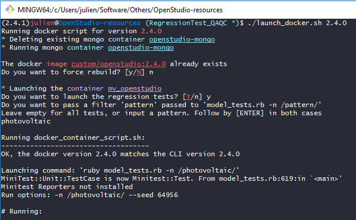
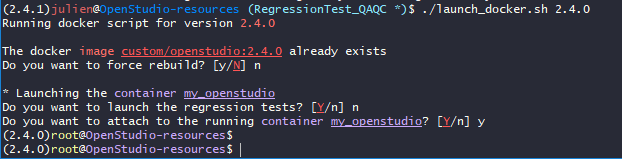
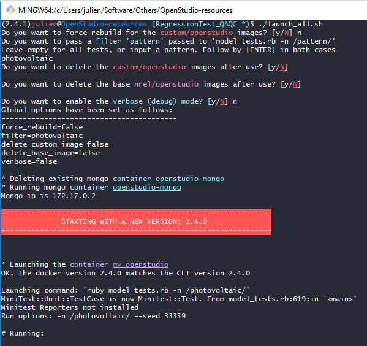
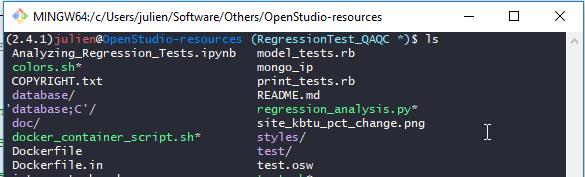

# Instructions for running past history using Docker.

Both scripts rely on the `Dockerfile.in` template and associated `.dockerignore` file,
and the script that is run inside the container is `docker_container_script.sh`.
You should not need to touch any of these files


## Why you would need to do it?

The history is saved in the `test` folder that stores all the out.osw.
If you add a new ruby test for an object that was present in the OS API for a while,
you would typically run the docker in all past docker version to identify the first version in which it worked,
and you would then want to get the resulting OSM to add it to the `model/simulationtest` folder as all tests should have a ruby and an OSM version.

**Note about rebuilding the custom docker image:**

**If you add a new test or modify an existing one that you want to run in docker, you need to rebuild**, 
because all the tests are sent as the build context and stored in the image.

## Launch a specific version

```bash
./launch_docker.sh 2.4.0
```



This script expects one and one only argument: the OS version you want to run for. You can find a list of available versions on DockerHub 
[nrel/openstudio](https://hub.docker.com/r/nrel/openstudio/tags/) (do not use 'latest').

A few questions will be asked: whether you want to force rebuild an existing image, whether you want to run the regression tests directly, if so which filter pattern, etc.
They all have sensible defaults so if you don't know what to respond, just press ENTER. Obviously, the one question that is the most interesting is the filter pattern, so don't skip this one
if you want to not run all tests (if blank = all tests are run).

**You will also be asked whether you want to attach to the container**, after you have run or not the regression tests, and will enter an interactive session inside the container
(the prompt may appear blank at first, just press enter). The prompt will change, indicating you are now in the docker container:



This is useful to investigate why a given test has failed, or to copy the resulting OSM created by running a new ruby measure back to the host (your physical machine).
Here is a snippet that will allow you to copy the resulting OSM to the `test` directory, which is shared with the host machine.

After running the test in question, eg with the filter `test_my_object_rb`, attach to the container:

```bash
cd testruns/my_object_rb/
# From within a testruns/my_object_rb/ directory:
cp in.osm ~/test/`basename ${PWD%.*}`.osm
```

This would have added a `my_object.osm` in your `test` directory that you can just cut and paste to `model/simulationtests` (remember to add this new test in the `model_tests.rb` file too).


## Launch all/multiple versions

```bash
./launch_all.sh
```



You can modify the hardcoded arguments atop the script `launch_all.sh`, **especially the list of versions you want to run against**.

You need to beware that **if you run the entire history back to OS 2.0.4, this is going to take several Gigabytes of disk space**.


## Configuring your machine for docker

### Unix (Linux/macOS)

You just need to install docker ([Get Docker](https://www.docker.com/get-docker)) and run the script(s) in your terminal.

### Windows

Currently the high-level utilities are in bash, so they will not run on windows without the unix utilities.

1. Install docker for Windows: see [here](https://docs.docker.com/docker-for-windows/install/). 
If you don't know which to choose between Stable and Edge, go for Stable.
You will need to log out and log back in.
Install Hyper-V and Containers if you are prompted for it (restart needed).

2. We will use mysys to be able to use bash. The easiest is to just rely on Git bash (mysysGit) since you probably already have it. If you have Git bash (MinGW), open that.
If not go to [git-scm](https://git-scm.com/downloads) and install it. Make sure you install command line utilities.
cd to your directory, then you can launch either of the scripts like above and it should work.


### Optional: Configuring MinTTY on Windows

The default appearance of MinTTY isn't great. We're going to change the colors used by the terminal as well as the default prompt.

The goal is to obtain a terminal that looks like this:



The colors are changed, the prompt is clearer and shows the openstudio version on your system, your username, and the current directory name, 
and not the full path which is in the title bar instead.


in `~./minttyrc` place the following lines:

```
# Dracula
ForegroundColour=248,248,242
BackgroundColour=40,42,54
Black=0,0,0
BoldBlack=40,42,53
Red=255,85,85
BoldRed=255,110,103
Green=80,250,123
BoldGreen=90,247,142
Yellow=241,250,140
BoldYellow=244,249,157
Blue=202,169,250
BoldBlue=202,169,250
Magenta=255,121,198
BoldMagenta=255,146,208
Cyan=139,233,253
BoldCyan=154,237,254
White=191,191,191
BoldWhite=230,230,230
```

In `~/.bashrc` place the following:

```bash
if test -f /etc/profile.d/git-sdk.sh
then
	TITLEPREFIX=SDK-${MSYSTEM#MINGW}
else
	TITLEPREFIX=$MSYSTEM
fi

if test -f ~/.config/git/git-prompt.sh
then
	. ~/.config/git/git-prompt.sh
else
	PS1='\[\033]0;$TITLEPREFIX:$PWD\007\]' # set window title
fi

# Default prompt
COLOR_0="0:37m" # Light Gray' 
COLOR_1="38;5;167m" # Some light red' 
COLOR_2="38;5;33m" # Some light blue'

# Try to get the openstudio version from ruby, redirecting error to dev/null`
export OSVERSION=`ruby -e "require 'openstudio'; puts OpenStudio::openStudioVersion" 2> /dev/null`
# If that work, start with it, eg "(2.4.1)"
if [ ! -z $OSVERSION ]; then
  PS1="$PS1""\[\033[$COLOR_0\](${OSVERSION})"
fi
# Add username, and workdir (without full path), eg : julien@directory
PS1="$PS1""\[\033[$COLOR_1\]\u\[\033[0m\]@\[\033[$COLOR_2\]\W\[\033[0m\]"

# Git specific
# add a * after branch name if dirty
export GIT_PS1_SHOWDIRTYSTATE=1
# Add branch name
PS1="$PS1"'\[\033[36m\]'  # change color to cyan
PS1="$PS1"'`__git_ps1`'   # bash function to add the branch name if any
PS1="$PS1"'\[\033[0m\]$ '        # change color
```